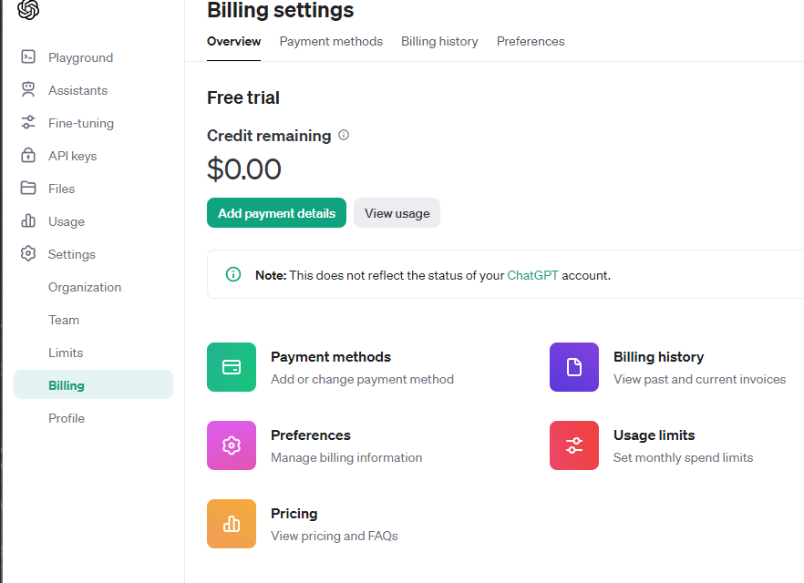
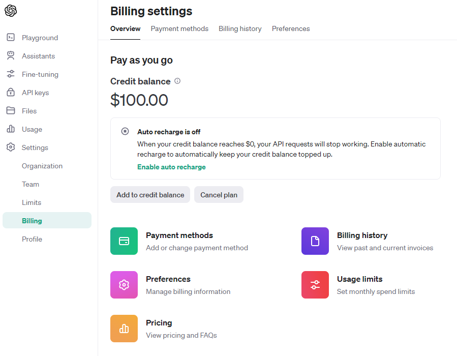
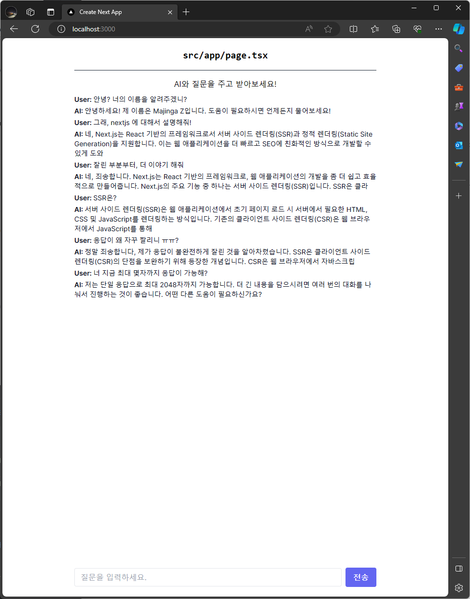
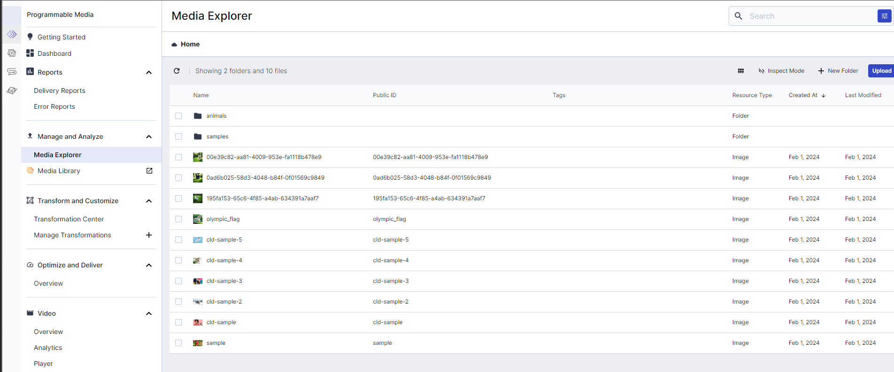
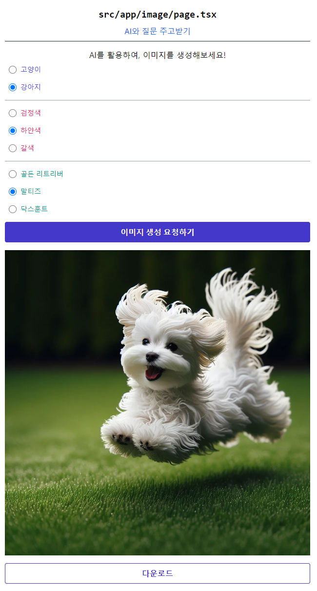

## nextjs-gpt

---

**1. 프로젝트 생성**

```
npx create-next-app@latest

What is your project named? nextjs-gpt
Would you like to use TypeScript?  Yes
Would you like to use ESLint? Yes
Would you like to use Tailwind CSS? Yes
Would you like to use `src/` directory? Yes
Would you like to use App Router? (recommended) Yes
Would you like to customize the default import alias (@/*)? No
```

**2. OpenAI API Key 발급**
 
- https://platform.openai.com/


- Create new secret key 를 클릭하여, 키를 생성
- 발급 받은 키를 .env 에 추가해주기
- .env 는 저장소에 커밋 푸시가 되지 않도록 주의

```
OPENAI_API_KEY=YOUR_API_KEY
```

**3. API 요청할 코드 작성**

- https://platform.openai.com/examples
- https://sdk.vercel.ai/docs/guides/providers/openai
- https://sdk.vercel.ai/docs/api-reference/use-chat
- https://platform.openai.com/docs/guides/text-generation/chat-completions-api   
- https://platform.openai.com/tokenizer   
위 링크를 가면, 친절하게 다양한 예제들을 제공해주고 있다.
- `npm i -S openai ai`
- 첫번째 API 요청 코드 작성해보기
- test 용 api 하나 작성
```
// app/api/hello/route.ts
export async function GET(request: Request, response: Response) {
    return Response.json('GET: hello api');
}
```

```
// app/services/openAiTestService.ts
import OpenAI from "openai";
const openai = new OpenAI({
    apiKey: process.env.OPENAI_API_KEY
});

export async function openAiMain() {
    const completion = await openai.chat.completions.create({
        messages: [{ role: "system", content: "You are a helpful assistant." }],
        model: "gpt-3.5-turbo",
    });

    console.log(completion.choices[0]);
}
```

- 429 에러(요청량 초과)가 발생하면, 크레딧이 없는거지 결제를 해야한다.(저는 100달러 충전 부가세 포함 110달러)



---

- `client.chat.completions.create` 는 OpenAI 의 GPT 모델을 사용하여 대화형 텍스트를 생성하는데 사용
```
model: 사용할 모델 이름을 정의
messages: 대화의 이전 메시지 목록을 포함 / 일반적으로 system role 을 가진 메시지로 설정한 후, user 와 assistant 메시지로 번갈아 주고 받음
max_tokens: 생성할 텍스트의 최대 토큰 수를 지정합니다. 토큰은 단어나 구에 해당하는 작은 텍스트 단위입니다.
temperature: 생성된 텍스트의 창의성 또는 예측 불가능성을 제어합니다. 0에서 1 사이의 값으로, 높을수록 더 창의적이고 무작위적인 응답을 생성
top_p: 확률적 샘플링에서 사용되는 값으로, 0과 1 사이의 값입니다. 이 값이 높으면 더 다양한 텍스트를 생성하며, 낮으면 더 예측 가능한 텍스트를 생성 
frequency_penalty: 자주 반복되는 단어나 구문의 사용을 줄이는 데 사용됩니다. 0에서 1 사이의 값으로 설정합니다. 
presence_penalty: 새로운 토픽이나 아이디어를 도입할 가능성을 증가시키기 위해 사용됩니다. 이 값이 높을수록 새로운 개념이나 주제를 도입할 가능성이 높아집니다.
```

---

1. 429 에러가 발생하여 크레딧이 없는걸 확인하여 크레딧 충전하여 해당 이슈를 해결했다.
2. chatGPT 와 같은 효과를 제공하고자, stream 옵션을 활성화 하였는데 해당 스트림을 어떻게 응답해주는지에서 시간을 허비하였다. Node 에서 처럼 response.write() 를 통하여 분할 전송을 해줘야하는데 Next 에서는 이부분이 처리가 불가능하여 검색을 해보니 vercel 에서 제공해주는 ai 패키지를 이용하여 해당 이슈를 해결했다.
3. ai 패키지에서 제공해주는 useChat() 훅을 사용하였으며, 로딩과 중단 처리까지 완료하였다. 
4. 입력 시, 정확한 답변을 얻고자(대화의 맥락을 설정) system 역할에게 "당신은 도움이 되는 조수입니다. 그리고, 매우 친절하고 성실히 답변을 해줍니다. 그리고, 너의 이름은 마징가 Z 다." 라는 말을 영어로 입력해주었다.



- 서버 사이드 렌더링(SSR)은 웹 애플리케이션에서 초기 페이지 로드 시 서버에서 필요한 HTML, CSS 및 JavaScript를 렌더링하는 방식입니다. 기존의 클라이언트 사이드 렌더링(CSR)은 웹 브라우저에서 JavaScript를 통해

133자, 98 토큰 -> 100 토큰을 걸어두었기에 짤린거임

---

- image 생성 부분 작성
- DALL-E-3 모델을 사용하여, 이미지를 생성하도록 함.
- 진행하면서, 컴포넌트 분리 및 추가적으로 아래 패키지들을 설치

```
class-variance-authority
clsx
tailwind-merge
```

- CVA(class-variance-authority) 를 적용한 이유는, 동적으로 tailwind css 를 작성하는 코드를 처리하려면 복잡해지고 어려워지는 부분때문이다. 이를 사용하면 읽기 쉽고 유지보수가 쉬워진다.

- 이미지 생성을 위한 프롬프트 엔지니어링 진행
```
I'm going to create an image of a dog or a cat. Specifically, make an image of a dog and the color is brown and the species is golden retriever.
```


```
Create an image showing a ${color} ${animal === 'dog' ? dogType : catType} ${animal} running on a green lawn. The image should not include any human elements such as hands, feet, or any other human features.
```


최종 프롬프트 문구는 이러하다.   
"갈색 페르시안 개가 푸른 잔디밭에 달리고 있는 모습을 보여주는 이미지를 만드세요. 이 이미지에는 사람의 손, 발, 또는 다른 어떠한 인간적 요소도 포함되지 않아야 합니다."

- 이미지 업로드를 위한, Cloudinary 계정 생성 및 저장소 생성
- 무료 사용자는 기본으로 클라우드 용량 100MB 제공
- settings - Account 를 가면 클라우드 이름 변경가능
- settings - Upload 를 가면, 프리셋 설정 가능



- 생성되는 이미지 용량이 크다보니, 클라우디너리 업로드 시 webp 포맷으로 변경하여 업로드를 한다.
- 생성된 이미지는 UI 표시가 되며, 다운로드를 하면 다운로드 처리가 되도록 하였다.


  