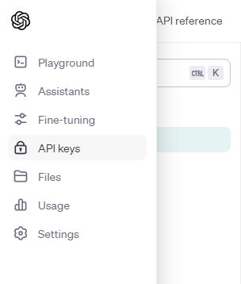
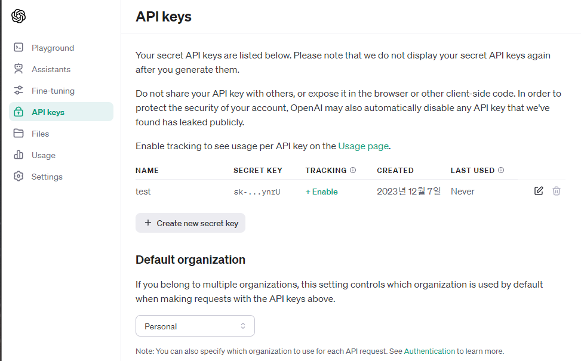

## nextjs-gpt

---

**1. 프로젝트 생성**

```
npx create-next-app@latest

What is your project named? nextjs-gpt
Would you like to use TypeScript?  Yes
Would you like to use ESLint? Yes
Would you like to use Tailwind CSS? Yes
Would you like to use `src/` directory? Yes
Would you like to use App Router? (recommended) Yes
Would you like to customize the default import alias (@/*)? No
```

**2. OpenAI API Key 발급**
 
- https://platform.openai.com/




- Create new secret key 를 클릭하여, 키를 생성
- 발급 받은 키를 .env 에 추가해주기
- .env 는 저장소에 커밋 푸시가 되지 않도록 주의

```
OPENAI_API_KEY=YOUR_API_KEY
```